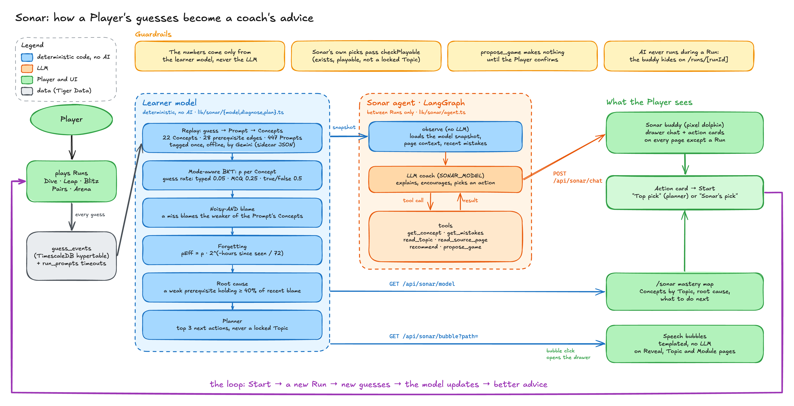

# Sonar: the study coach (F32, #73)

Sonar is a coach and buddy that knows where a Player stands in their material. It tells them what to practise next and why, and it chats about their mistakes. It has two halves:

1. **The learner model** (deterministic code): a mastery score per concept, worked out from the Player's own guesses. It decides **what is true**: what you know, what is weak, what is the root cause.
2. **The Sonar agent** (LangGraph + Gemini): reads that model through tools, looks at your actual wrong answers and the Topic readings, and explains, encourages and recommends. It decides **how to say it**, and picks among options the model ranked. It never invents a mastery number, and it can only recommend Games that exist.

Terms: `CONTEXT.md` (Player, Course, Topic, Practice Game, Run, Prompt, Game Mode). New terms: **Concept**, **Concept mastery**, **Root cause** (below).



Source: `docs/img/sonar-pipeline.excalidraw` (open it at excalidraw.com; `.svg` beside it).

## What was built (v0 vs. this plan)

The rest of this doc is the plan. Where v0 differs:

- **The drawer replaced the chat page.** Chat lives in the floating buddy's drawer on every page (hidden during a Run); `/sonar` is the mastery map and its action cards (Decisions Q4, Q9).
- **Root cause counts every Concept a missed Prompt tested,** not only the Concept the miss was on: a Concept qualifies when it is a prerequisite of any of them.
- **The demo story is `range()` boundaries, not comparisons.** The Loops Prompts don't test comparison operators (their tags say so), so tags weren't bent to fit the plan. `npm run sonar:demo` gives the Loops Topic misses on `range()`'s stop, start and step, including for-loop Prompts tagged `[range_fn, for_loops]`. The root cause Sonar names is **`range()`** (about 11%, about 89% of the recent blame, for the misses on for loops). Topic 3 has comparison misses too, so the map shows "Course: passed, Sonar: 57%" on Operators & Expressions.
- **The planner ranks on `p`; the UI and the card text show `pEff`.** Forgetting changes what is displayed, not the order of the ranked actions (except the fading-Concept review).
- **The coach is Claude Sonnet 5.5** (`SONAR_MODEL` default `claude-sonnet-5-5`, `ANTHROPIC_API_KEY`), traced in LangSmith. `anthropic/<model>` would route it through the LangSmith LLM Gateway instead, but that beta isn't enabled on the free plan (403). Thinking is set to `between_tools` (off), for speed and so the trimmed history never replays thinking blocks. Gemini (`GEMINI_MODEL`, then `GEMINI_FALLBACK_MODEL`) is the fallback, and is used alone when no Anthropic key is set. The agent also has `read_source_page` and `propose_game` for Module pages.

## v0 scope (hackathon, ~2.5 h)

Python Basics only, because its content is known, hand-checked and already has a Practice Game per Mode for every Topic.

| In v0 | Not in v0 (later, see § Expansion) |
|---|---|
| Concept graph + Prompt tags for Python Basics, in a JSON sidecar | Concepts for a Player's own Modules (generation pipeline change) |
| Learner model computed on read by replaying `guess_events` | A `learner_concept_state` table and a Run-engine hook |
| Sonar agent: a briefing on page load, then chat | Persistent agent memory across server restarts |
| Recommends **existing** Topic Practice Games | Focus Games assembled from tagged Prompts |
| `/sonar` page: mastery map, chat, action cards | Animated concept DAG, blame pulses, time-warp |
| | Misconception-tagged distractors, teach-back grading |

**No DB migration and no change to the Run engine** in v0. Nothing here touches a Run, so play stays fast and offline from AI. The architecture rule "AI only at generation time" becomes "**AI never during a Run**": Sonar runs on its own page, between Runs.

## Concepts

A **Concept** is one skill a Prompt tests (e.g. `comparison_ops`, `range`, `return_vs_print`). Concepts form a prerequisite DAG: an edge `A → B` means B builds on A. Each Topic groups a few Concepts.

The sidecar `db/seed/courses/python-basics.sonar.json`:

```jsonc
{
  "course": "python-basics",
  "concepts": [
    { "id": "comparison_ops", "name": "Comparison operators", "topic": "operators-expressions",
      "summary": "==, !=, <, <=, >, >= and what they return", "pages": [2] }
  ],
  "edges": [ ["comparison_ops", "conditions"] ],          // [prereq, concept]
  "tags": { "<sha1 of prompt text>": ["comparison_ops", "while_loop"] }   // 1–3 per Prompt, primary first
}
```

- About 18 Concepts across the 6 Topics, written by hand (they're small and must be right).
- Prompt tags are written once by a script (`scripts/sonar-tag.mts`: one Gemini call per Topic, given the Topic's Concepts and Prompts), reviewed, and committed. They are **keyed by a hash of the Prompt text**, not by Game or Prompt id, so the seeded Games (content-hashed, `lib/courses/seed.ts`) never change, and Apogee's Prompts (copied from Dive) share Dive's tags.
- A Prompt with no tag falls back to its Topic's Concepts.

## Learner model (`lib/sonar/model.ts`, pure)

Computed on each request: load the Player's `guess_events` on Python Basics Practice Games (oldest first), map each guess to its Prompt's Concepts, and replay them through Bayesian Knowledge Tracing (BKT).

**Per Concept:** `p` = probability the Concept is known (prior 0.3), `n` = observations, `lastSeen`, plus counts of right, wrong and timeouts, and the median time to a correct answer.

**The Mode sets the guess rate**, because some answers are easy to get right by luck:

| Evidence | P(guess) | P(slip) |
|---|---|---|
| Dive / Apogee typed answer (open, cloze, definition) | 0.05 | 0.10 |
| Dive odd-one-out, Leap, Arena (4 options) | 0.25 | 0.10 |
| Leap after the 50/50 (`hint_used`) | 0.50 | 0.10 |
| Blitz true/false | 0.50 | 0.15 |
| Pairs match | 0.20 | 0.10 |
| Dive with the Hint revealed | 0.30 | 0.10 |
| Dive ordered recall | 0.05 | 0.15 |

Learn rate T = 0.10 per observation. A timeout counts as wrong.

**More than one Concept per Prompt (noisy-AND).** A Prompt tagged {A, B} is answered right with probability 1 − slip when every Concept is known, else with the guess rate. With at most 3 Concepts, enumerate the 2^k knowledge states and compute each Concept's exact posterior. A miss then lowers the weaker Concept more: that is **blame**, and it's recorded per miss.

**Forgetting (display only in v0):** `pEff = p · 2^(−hoursSinceLastSeen / 72)`.

**Status:** `mastered` pEff ≥ 0.85 and n ≥ 3 · `learning` 0.5–0.85 · `weak` < 0.5 · `unseen` n = 0.

**Root cause** (`lib/sonar/diagnose.ts`, pure). Over the last 10 misses, sum each Concept's blame. A Concept is a **Root cause** when it is weak or learning, it is a prerequisite (direct or indirect) of the Concept the misses were on, and it holds ≥ 40 % of their blame. The point it can make: "your Loops misses come from Comparisons, which the Course already counts as passed."

**Ranked next actions** (`lib/sonar/plan.ts`, pure). Candidates are (Concept, Practice Game). In order:
1. Root cause → its Topic's Game in the Mode for its status.
2. Weakest Concept whose prerequisites are all ≥ 0.7 (the frontier), ties broken by how many Concepts depend on it.
3. A fading Concept (p ≥ 0.85, pEff < 0.6) → a quick review.

Mode for a status: `weak` → Leap (recognition, and the reading first) · `learning` → Dive (typed recall) · mastered but only seen in Blitz or Leap → Dive to confirm · `mastered` → Arena or the next Topic. Each candidate carries a `why` trace (the numbers that put it there). The top 3 go to the agent.

## The Sonar agent (`lib/sonar/agent.ts`)

Packages: `@langchain/langgraph`, `@langchain/core`, `@langchain/google-genai` (`ChatGoogleGenerativeAI`, model from `GEMINI_MODEL` with `GEMINI_FALLBACK_MODEL` via `.withFallbacks`). Server only.

```
START ─▶ observe ─▶ coach ⇄ tools ─▶ END
```

- **observe** (no LLM): builds the learner model, the root cause, the top 3 actions and the last 8 mistakes, and puts a compact snapshot into the graph state. Every turn starts from fresh numbers.
- **coach** (Gemini with tools bound): writes the reply. Its system prompt holds the persona (Lumen's colleague Sonar: short, warm, specific, never invents numbers or facts, quotes the reading) and the snapshot.
- **tools** (`ToolNode`):

| Tool | Returns |
|---|---|
| `get_concept(id)` | its mastery, status, prerequisites and dependants, recent misses on it |
| `get_mistakes(conceptId?, limit?)` | wrong guesses: the Prompt, what the Player answered, the right Answer, the explanation, the Evidence page |
| `read_topic(topicSlug, page?)` | the Topic's reading (markdown), so explanations quote the Player's material |
| `recommend(actionIndex, message)` | picks one of the ranked actions (index 0–2 only) and attaches a one-line pitch. The UI shows it as a card with a Start button. |

**Guardrails:** the agent can only recommend a ranked action (the tool rejects anything else), and the numbers on the page come from the model, not from the agent's text.

**Memory:** `MemorySaver` checkpointer, `thread_id` = the Player id, so the chat continues while the server runs. It is lost on restart (fine for v0).

**Turns:**
- **Briefing** (on page load): the server sends a fixed instruction ("Brief the Player"). Sonar says where they stand in 3–4 sentences, names the root cause if there is one, and calls `recommend`.
- **Chat:** the Player asks ("why am I bad at loops?", "explain range again", "what should I do in 10 minutes?"). Sonar answers with tools.

## Decisions (grill session, 2026-10-04)

| # | Decision |
|---|---|
| Q1 | Python Basics gets the full map and recommendations. On Module pages Sonar reads the Player's mistakes and source pages and chats about them; there is no concept map for Modules in v0. |
| Q2/Q8 | Mixed. The planner ranks a top 3. Sonar may pick one of them **or** any other Game, which needs a reason and must pass a server check (the Game exists, the Player can play it, it isn't a locked Topic). Cards say "Top pick" (planner) or "Sonar's pick". |
| Q3 | A custom `StateGraph`: `observe` → `coach` ⇄ `tools`. |
| Q4 | Sonar is a **floating buddy on every page** (a drawer), including Module pages, and hidden during a Run (`/runs/[runId]`). |
| Q5/Q12 | A new mascot: **Sonar, a baby pixel dolphin**. Its states are idle bob, ping rings while thinking, and talking. |
| Q6 | A seeded demo history, plus one live Run on stage. |
| Q9 | The mastery map is a full `/sonar` page; the drawer links to it. |
| Q10 | A speech bubble pops from the mascot on Reveal, Topic and Module pages, templated from the model with no LLM. Clicking it opens the drawer with that prompt. |
| Q11 | On Module pages Sonar can **propose a new Game** (a confirm card). On confirm the client calls the existing `POST /api/modules/[moduleId]/games`. Games are made from whole files, not page ranges. |
| Q13 | Four parallel agents, each in its own worktree, with the lead merging into `feat/73-sonar-coach`. |

The drawer replaces the "/sonar page with chat" in § API and UI. Chat lives in the drawer and `/sonar` is the map. `POST /api/sonar/chat` returns `{ reply, actions: Action[] }` and takes `{ message?, context: PageContext }`. `GET /api/sonar/bubble?path=` returns `{ bubble }`.

## Contracts and ownership (parallel build)

Shared, written by the lead (change only via the lead): `lib/sonar/types.ts` (every shape), `lib/sonar/client.ts` (`openSonar()`, the `sonar:open` event), `lib/sonar/context-path.ts` (`contextFromPath`, `isRunScreen`), `lib/sonar/fixtures.ts` (the demo story as a fake model and reply), the Concepts and edges in `db/seed/courses/python-basics.sonar.json` (ids are fixed), `loadSonarModel(playerId, db?)` in `lib/sonar/queries.ts` (stub → A).

| Agent | Owns |
|---|---|
| A: model | the `tags` and `pages` in the sidecar, `scripts/sonar-tag.mts`, `lib/sonar/{graph,model,diagnose,plan}.ts` + tests, the real `loadSonarModel`, `app/api/sonar/model/route.ts` |
| B: agent | `lib/sonar/{agent,tools,mistakes,playable,page-context}.ts` + tests, `app/api/sonar/chat/route.ts` |
| C: UI | `components/sonar/*` (mascot, drawer `SonarBuddy`, action cards, map), `app/sonar/page.tsx`, mounting `SonarBuddy` in `app/layout.tsx` |
| D: demo and glue | `scripts/sonar-demo.mts` (+ npm script), `lib/sonar/bubble.ts` + tests, `app/api/sonar/bubble/route.ts`, the "Ask Sonar" links on the Reveal, Topic and Module pages |

## API and UI

| Method | Route | Auth | Returns |
|---|---|---|---|
| GET | `/api/sonar/model` | signed in | `{ concepts: ConceptState[], edges, rootCause, actions }` |
| POST | `/api/sonar/chat` | signed in | body `{ message?: string }` (none = briefing) → `{ reply: string, recommendation: Action \| null }` |

`/sonar` (signed in, linked from the nav and the Course page):
- **Left:** the mastery map. Concepts grouped by Topic, each with a bar and status colour (mastered / learning / weak / unseen), the root cause outlined in red, the recommended Concept lit by Lumen's lantern. A "Course says Passed / Sonar says 41 %" chip on Topics where they disagree.
- **Right:** the Sonar chat. Briefing first, recommendation cards with **Start** (`POST /api/games/[gameId]/runs`, then `/runs/[id]`), and a text box.
- After a Run on a Course Game, the Reveal's back link goes to the Topic page as today. v0 adds a "Ask Sonar" link there.

## Demo setup

A seed script (`scripts/sonar-demo.mts -- <playerId>`) plays fake Runs for a demo Player by writing `guess_events` directly. It gives them strong Topics 1–2, Topic 3 passed but with misses on comparisons, and Loops misses on range() boundaries (the root cause, see § What was built). Running it again resets that Player's Course guesses first.

## Time plan (2.5 h)

| Slot | Work |
|---|---|
| 0:00–0:25 | Concept graph (hand) + `sonar-tag.mts` run and review |
| 0:25–0:55 | `model.ts`, `diagnose.ts`, `plan.ts` + unit tests; `GET /api/sonar/model` |
| 0:55–1:35 | LangGraph agent, tools, `POST /api/sonar/chat` |
| 1:35–2:05 | `/sonar` page: map, chat, cards |
| 2:05–2:20 | Demo seed, run it end to end |
| 2:20–2:30 | `tsc`, lint, tests, worklog, PR |

Cut order if late: the "Course says / Sonar says" chip, then chat (keep only the briefing), then the demo seed (play real Runs instead).

## Expansion (after v0)

1. Concepts for a Player's own Modules: Gemini emits Concepts, edges and tags at generation time.
2. `learner_concept_state` + `mastery_events` hypertable, updated in `afterFinish()`; the Reveal shows concept deltas.
3. Focus Games: assemble a targeted Game from tagged Prompts in ~100 ms.
4. Misconception tags on Leap distractors and Blitz false statements; Sonar names the wrong belief.
5. Animated concept DAG with blame pulses and a time-warp slider.
6. Teach-back: explain a Concept to Sonar, graded against a rubric from the reading.
7. Persistent memory (`@langchain/langgraph-checkpoint-postgres` on Tiger Data) and a proactive nudge on `/home`.
